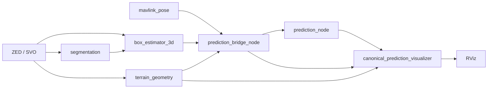

# Prediction refactor: triển khai và đo replay

Đợt refactor này giữ thuật toán vật lý canonical, model YOLO, `image_size=960`
và cấu hình terrain. Phạm vi kiểm chứng là replay SVO với MAVLink ground truth;
chưa kiểm chứng điều khiển robot live hoặc dự báo chuyển động vật cản.

## Pipeline sau refactor



Có 7 node LR trong profile dynamic. ZED component, robot state publisher và
RViz không nằm trong số này. Bridge chuyển Path thành trajectory rồi lấy mẫu
geometry trực tiếp, không nhận lại `/trajectory` qua DDS. Profile static không
tạo subscription pose hay bộ sai phân trạng thái trong bridge. Bốn executable
adapter cũ là wrapper dùng chung các converter mới.

Display launch dùng launch prediction chung. Lệnh test cũ giữ nguyên; thêm
`start_rviz:=false` để đo không có giao diện. `bridge_params_file` cấu hình bridge,
`prediction_runtime_params_file` cấu hình runtime, `prediction_params_file`
cấu hình visualization và `prediction_rover_config` cấu hình vật lý.

Các quy tắc dữ liệu đã áp dụng:

- Tuổi tối đa tính theo timestamp trajectory: objects 0,5 s, GridMap 2 s,
  state 0,25 s. Các giới hạn có thể cấu hình. Runtime chọn mẫu hợp lệ gần nhất
  ở trước hoặc cùng timestamp; mẫu tương lai không hoàn thành chu kỳ.
- Batch objects rỗng giữ timestamp quan sát. Thiếu TF, detection không hợp lệ
  và reset không tạo bằng chứng “không có vật cản”.
- Header geometry giữ timestamp GridMap; trường `source_trajectory_*` liên kết
  chu kỳ. Ô terrain chưa được chấp nhận hoặc ngoài vùng dữ liệu vẫn là unknown.
- Path, pose, GridMap phải đúng frame. Boxes khác frame được chuyển bằng TF
  theo timestamp, thử lại trong thời hạn mà không chặn executor của bridge.
- Tua ngược hoặc đổi clock xóa cache, bộ đệm, lịch sử gia tốc, tracking và
  cảnh báo. Trajectory ID tiếp tục tăng trong vòng đời bridge.
- Mask/depth được ghép gần nhất trong 50 ms, tối đa 30 mẫu mỗi luồng và 1 s
  lịch sử. Mỗi mẫu dùng tối đa một lần; đầu vào tracker giữ thứ tự timestamp.
- GridMap sampler được dùng chung giữa bridge và presentation. Physics cũ
  trong `lr_path_prediction` đã bỏ; kiểu presentation được tách riêng.
- Overlay, heatmap và markers chỉ được dựng khi có subscriber. Mask, boxes,
  GridMap và output prediction tiếp tục xuất cho pipeline.
- ID tracking của box được giữ; `velocity_valid=false` vì chưa có đầu vào
  vận tốc vật cản thực sự. `/predict_output` vẫn là bằng chứng vật lý, chưa
  quyết định Stop/Go.

## Kết quả đo

Đo ngày 2026-09-05 trên Intel i5-11400H, RTX 3050 Laptop 4 GiB, ROS Humble,
ZED SDK 5.4.1. Hai lượt chạy tuần tự cùng ZED component đã build với patch
realtime pause hiện có trong repository, không chạy test/build đồng thời.
Không mở RViz và không subscribe overlay/heatmap/markers.

Baseline lấy mã Python LR và display launch từ commit
`fd6d9d1074db38b5d45778c3da6cca8e7e1434b3`. Chỉ bỏ action RViz trong launch
baseline để hai lượt có cùng điều kiện headless; dùng cùng ROS messages,
driver, model và thông số perception. SVO:
`/workspace/svo/zed_20260710_092420_0001.svo2`, MAVLink session:
`session_20260710_0924_mavlink/session_mavlink.db`.

Mỗi lượt bỏ 10 giây SVO đầu, rồi đo 60 giây tiếp theo. Timestamp SVO đầu tiên
là `1783700660.562045`; cửa sổ đo bắt đầu ở timestamp đầu + 10 s và kết thúc
ở timestamp đầu + 70 s. Observer ghi tài nguyên khoảng 1 Hz.

| Chỉ số | Trước | Sau |
|---|---:|---:|
| Node LR | 10 | 7 |
| Tiến trình headless | 12 | 9 |
| CPU trung bình (100% = 1 CPU) | 405.5% | 390.1% |
| Tổng RSS trung bình / đỉnh (MiB) | 3171.8 / 3183.9 | 2989.0 / 3014.5 |
| VRAM trung bình / đỉnh (MiB) | 945 / 945 | 945 / 945 |
| GPU utilization trung bình | 47.3% | 51.0% |
| Mask nhận được / 60 s | 426 | 478 |
| Batch boxes nhận được / 60 s | 52 | 402 |
| Tỷ lệ batch boxes / mask | 12.2% | 84.1% |
| Trajectory / prediction nhận được | 222 / 207 | 223 / 205 |
| Tỷ lệ chu kỳ hoàn thành | 93.2% | 91.9% |
| Prediction latency SVO p50 / p95 (ms) | 0.0 / 0.0 | 0.0 / 53.6 |
| Terrain callback trung bình / p95 mẫu (ms) | 148.06 / 266.62 | 40.37 / 177.21 |
| Segmentation callback trung bình / p95 mẫu (ms) | Chưa đo | 85.19 / 102.20 |
| Box estimator callback trung bình / p95 mẫu (ms) | Chưa đo | 16.98 / 27.00 |
| Prediction callback trung bình / p95 mẫu (ms) | Chưa đo | 1.02 / 3.14 |

CPU trung bình giảm 3,8%, tổng RSS giảm khoảng 183 MiB (5,8%). Tỷ lệ hoàn
thành chu kỳ giảm 1,3 điểm phần trăm trong cặp lượt này. Trong 60 mẫu
diagnostic runtime của lượt sau, 55 mẫu báo ready, 2 mẫu chờ objects còn hạn
và 3 mẫu không có geometry hợp lệ tại trajectory. Đây là các mẫu trạng thái,
không phải số chu kỳ bị bỏ. Bộ đếm box cuối lượt (gồm warmup) ghi 457/550
mask được ghép, 92 mask bị loại và không có lỗi TF.

CPU là tổng phần trăm của các tiến trình con pipeline; 100% tương ứng một
logical CPU. RSS là tổng resident memory, có thể đếm lặp shared pages, không
phải bộ nhớ riêng PSS. VRAM và GPU utilization là số đo toàn GPU. Số tiến
trình không gồm `ros2 launch` hoặc observer.

Tỷ lệ boxes/mask là số batch boxes nhận được chia số mask nhận được trong
cửa sổ; đây là chỉ báo hiệu quả ghép và xử lý, không phải accuracy của
segmentation. Diagnostic mới ghi thêm bộ đếm matched pairs và TF failures.
Các callback được lấy mẫu từ diagnostic 1 Hz; giá trị trung bình/p95 này
không phải phân bố của toàn bộ callback. Baseline chưa có instrumentation
cho callback segmentation, boxes và prediction, nên không có số trước để
so sánh các callback đó.

Latency trong report là `PredictionOutput.header.stamp - trajectory.header.stamp`
theo clock SVO 15 Hz. Giá trị 0 không có nghĩa là xử lý tức thời: clock chỉ
cập nhật khoảng 66,7 ms một lần. Chưa đo latency wall-time toàn pipeline bằng
tracing. Kết quả là một cặp lượt chạy trên một đoạn SVO, không phải cam kết
FPS trên toàn bộ bản ghi hay với RViz đang mở.

Số liệu tóm tắt được lưu trong [prediction-refactor-results.json](prediction-refactor-results.json).
Report thô và launch log của workspace nằm tại
`log/prediction-refactor-final-before/`, `log/prediction-refactor-final-after/`
và `log/prediction-replay-smoke/`; thư mục `log/` không được đưa vào Git.

## Kiểm chứng

Build thành công 7 package thay đổi. `colcon test` chạy từng package:

| Package | Python tests đạt |
|---|---:|
| `prediction_core` | 15 |
| `prediction_ros` | 4 |
| `lr_prediction_bridge` | 11 |
| `lr_segmentation` | 24 |
| `lr_terrain_geometry` | 36 |
| `lr_path_prediction` | 10 |
| `lr_display_rviz2` | 8 |
| **Tổng** | **108** |

9 kiểm tra lint của display cũng đạt. Các test bao gồm static/dynamic và
wrapper cũ; mask đến muộn/thiếu depth; TF đến muộn/hết thời hạn; batch rỗng;
input cũ/tương lai/sai frame; terrain thiếu; gia tốc chưa hợp lệ; input đến
khác thứ tự qua DDS; reset; và mỗi trajectory chỉ có một prediction.

Fixture evidence được tạo bằng canonical core trước refactor cho mặt phẳng,
dốc, gia tốc động, khoảng hở collision, giao footprint và terrain thiếu.
Core sau refactor khớp collision, SSM, Stability Moment và ZMP trong sai số
`1e-6`, bỏ qua timestamp wall-time của lần tính. Không thay đổi thuật toán
trong `predictor.py`, `collision.py` và `rollover.py`.

Smoke test dùng lệnh gốc có RViz trên SVO thật, kiểm tra qua dịch vụ ZED:
đúng 7 node LR, pause dừng clock/prediction sau khi xử lý xong dữ liệu đang
chờ, resume có kết quả, seek về frame 0 làm clock chạy lùi, ID tiếp tục tăng,
gia tốc đầu tiên trở lại chưa hợp lệ, markers cũ bị xóa và prediction phục hồi.

Các lượt kiểm chứng ghi nhận RViz đóng không ổn định sau SIGINT: một lượt
thoát `-11`, lượt cuối không thoát trong 5 giây và launch phải gửi SIGTERM
(`-15`). Các kiểm tra replay phía trên đã hoàn thành trước đó; chưa xác định
nguyên nhân lỗi đóng RViz. Hai benchmark headless không gặp lỗi này. Preset
stereo đã bỏ các panel/display Nav2 và ZED object/body không dùng và không
được cài trong workspace.

## Chạy lại

```bash
source /opt/ros/humble/setup.bash
source /workspace/lr-ros2/install/setup.bash

colcon test --packages-select prediction_core prediction_ros lr_prediction_bridge \
  lr_segmentation lr_terrain_geometry lr_path_prediction lr_display_rviz2 \
  --executor sequential
colcon test-result --verbose

python3 scripts/benchmark_prediction.py \
  --output log/prediction-refactor-after \
  --svo /workspace/svo/zed_20260710_092420_0001.svo2

python3 scripts/verify_prediction_replay.py \
  --svo /workspace/svo/zed_20260710_092420_0001.svo2
```

Nếu component chưa có service pause ở chế độ realtime, build một lần bằng
script có sẵn rồi source workspace lại:

```bash
CMAKE_BUILD_PARALLEL_LEVEL=2 bash scripts/build_zed_realtime_pause.sh --executor sequential
source install/setup.bash
```

Để đo lại baseline, giải nén commit gốc vào thư mục riêng và chỉ định launch
đã lưu. Observer tự đặt `PYTHONPATH` của tiến trình con về mã LR trong archive;
không ghi đè mã đang làm việc:

```bash
mkdir -p /tmp/lr-prediction-baseline
git archive fd6d9d1074db38b5d45778c3da6cca8e7e1434b3 src/lr-ros2 \
  | tar -x -C /tmp/lr-prediction-baseline
python3 scripts/benchmark_prediction.py \
  --output log/prediction-refactor-before \
  --svo /workspace/svo/zed_20260710_092420_0001.svo2 \
  --baseline-source /tmp/lr-prediction-baseline/src/lr-ros2/lr-display-rviz2/launch/display_zed_cam.launch.py
```
