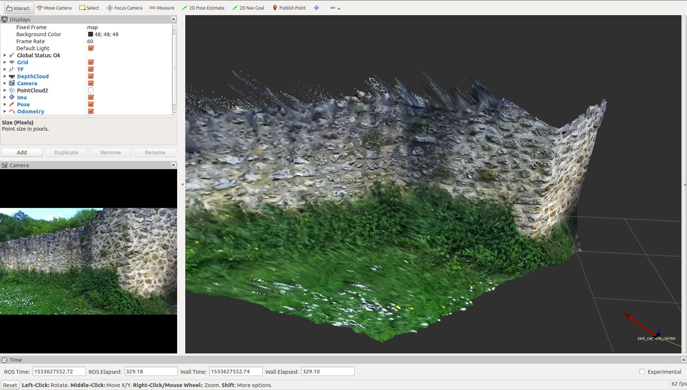
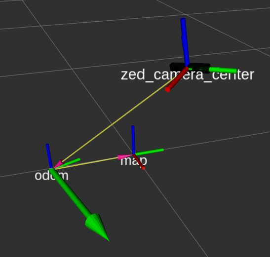
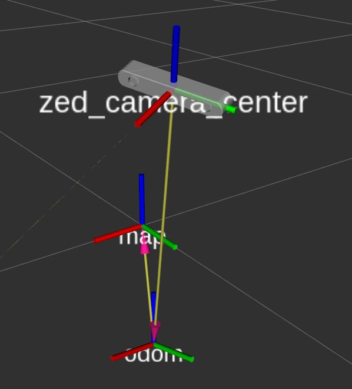

# Stereolabs ZED Camera - ROS 2 Display package

This package lets you visualize in the [ROS 2 RViz application](https://github.com/ros2/rviz/tree/foxy) all the
possible information that can be acquired using a Stereolabs camera.
The package provides the launch files for ZED, ZED Mini and ZED 2 camera models.

**Note:** The main package [zed-ros2-wrapper](https://github.com/stereolabs/zed-ros2-wrapper)
is required to correctly execute the ROS node to acquire data from a Stereolabs 3D camera.

## Getting started

- First, be sure to have installed the main ROS package to integrate the ZED cameras in the ROS framework: [zed-ros2-wrapper](https://github.com/stereolabs/zed-ros2-wrapper/#build-the-package)
- [Install](#Installation) the package
- Read the online documentation for [More information](https://www.stereolabs.com/docs/ros2/)

### Prerequisites

- ROS 2 Foxy Fitzroy (deprecated), ROS 2 Humble Hawksbill, or ROS 2 Jazzy Jalisco:
  - [Foxy on Ubuntu 20.04](https://docs.ros.org/en/foxy/Installation/Linux-Install-Debians.html) - [**Not recommended. EOL reached**]
  - [Humble on Ubuntu 22.04](https://docs.ros.org/en/humble/Installation/Linux-Install-Debians.html) - [EOL May 2027]
  - [Jazzy Jalisco on Ubuntu 24.04](https://docs.ros.org/en/jazzy/Installation/Linux-Install-Debians.html) - [EOL May 2029]

### Installation

The *lr_display_rviz2* is a colcon package. 

Install the [zed-ros2-wrapper](https://www.stereolabs.com/documentation/guides/using-zed-with-ros/introduction.html) package
following the [installation guide](https://github.com/stereolabs/zed-ros2-wrapper#build-the-package)

Install the [zed-ros2-examples](https://github.com/stereolabs/zed-ros2-examples) package following the [installation guide](https://github.com/stereolabs/zed-ros2-examples#build-the-package)

### Execution

Use the following launch command to start the ZED ROS2 Wrapper node and RVIZ2 with the default setting for the camera that you are using:

```bash
$ ros2 launch lr_display_rviz2 display_zed_cam.launch.py camera_model:=<camera_model>
```

Replace `<camera_model>` with the model of the camera that you are using: `'zed'`, `'zedm'`, `'zed2'`, `'zed2i'`, `'zedx'`, `'zedxm'`, `'virtual'`.

To play an SVO file in real time and publish its clock, use:

```bash
$ ros2 launch lr_display_rviz2 display_zed_cam.launch.py \
    camera_model:=<camera_model> \
    svo_path:=/path/to/recording.svo2 \
    svo_realtime:=true \
    publish_svo_clock:=true
```

Set `svo_realtime:=false` to process every frame instead of preserving the
recorded timing. In that mode, playback speed can be customized through the
ZED wrapper configuration.

For stereo cameras the launch file also starts `lr_terrain_geometry` by
default. Use `start_terrain_node:=false` to disable it, or override
`terrain_params_file` and `map_frame` for a different terrain setup. The
terrain heatmap is shown as an Image dock inside the main RViz window, in the
former Depth Map position. The ZED Depth Map remains available but is disabled
by default. The central 3D Terrain group remains disabled by default and can be
enabled for GridMap and marker debugging.

Instance segmentation starts automatically when an external checkpoint path
is provided:

```bash
$ ros2 launch lr_display_rviz2 display_zed_cam.launch.py \
    camera_model:=zed2i \
    svo_path:=/path/to/recording.svo2 \
    segmentation_model_path:=/path/to/best.pt
```

The `start_segmentation_node` argument defaults to `auto`; use
`start_segmentation_node:=false` to explicitly disable segmentation.

The existing RGB dock then shows `/segmentation/overlay`, the node's only
output. When no model path is provided, segmentation is disabled and the same
dock is remapped to the original ZED RGB image. The original RGB topic is also
retained as the disabled `ZED RGB` display. Terrain processing remains
independent and does not consume segmentation output.





[Detailed information](https://www.stereolabs.com/docs/ros2/rviz2/)
